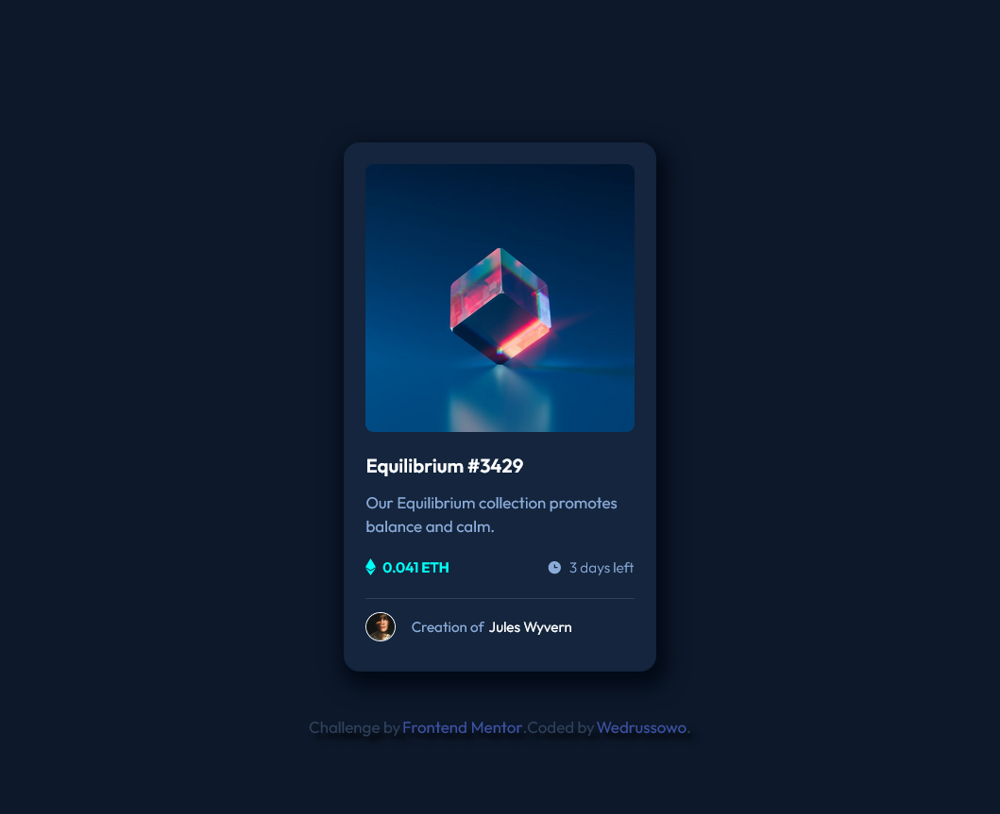

Hello, this is my solution of NFT preview card component, with the Frontend Mentor.

### Screenshot

### Links

- Solution URL: [Add solution URL here](https://github.com/Wedrussowo/Frontendmentor-projects/tree/main/nft-preview-card-component-main)
- Live Site URL: [Add live site URL here](https://wedrussowo.github.io/Frontendmentor-projects/nft-preview-card-component-main/)

### Built with

- Semantic HTML5 markup
- CSS custom properties
- Flexbox

### What I learned

After this project I:
- understand better process of matching the picture to the container.
- feel more comfortable with the clamp function
- also started to feel more comfy with the scale, translate, positioning

### Continued development

The more projects I do the more Flexbox I use everywhere I can, don't know if it's good x_X 

## Author

- Frontend Mentor - [@wedrussowo](https://www.frontendmentor.io/profile/wedrussowo)

